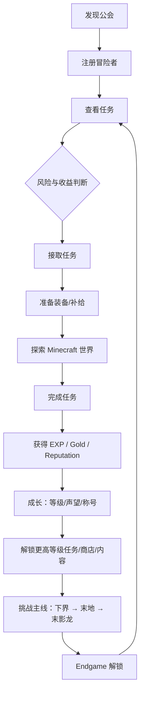

# 03 核心玩法循环

## 总体循环（Mermaid）



## 循环为什么成立

| 环节 | 设计目的 |
| --- | --- |
| 发现公会 | 世界反馈：建筑真实存在于地表，探索即发现 |
| 注册 | 建立玩家"身份"，解锁系统入口 |
| 任务选择（风险/收益/等级/时间/类型） | 让玩家做决策，而非无脑接取 |
| 准备 | 商店/饰品/任务刷新形成消耗循环 |
| 执行 | 驱动原版行为（采集/狩猎/探索/生存/运输/讨伐） |
| 奖励 | 三种货币各司其职（EXP=成长、Gold=经济、Reputation=资历） |
| 解锁 | 等级/声望/章节构成纵向目标 |
| Endgame | 延长生命周期，龙后仍有 24 个目标 |

## 三货币分工

| 货币 | 主要产出 | 主要消耗 | 节奏 |
| --- | --- | --- | --- |
| EXP | 任务/主线 | 无消耗，累积升级 | 短期可见（1-2 次任务可升级） |
| Gold | 任务/主线/未来出售 | 商店/刷新 | 中期循环（赚钱→花掉） |
| Reputation | 任务/高品质/特殊任务 | 解锁门槛（V1.2 可加消耗） | 长期资历（跨章节积累） |

## 玩家心理曲线

```
新鲜（发现公会）→ 身份（注册）→ 目标（任务墙）
→ 紧张（风险判断）→ 专注（执行）→ 满足（奖励+升级）
→ 期待（新解锁）→ 挑战（主线/Endgame）→ 持续
```

## 数据支撑

- 每日 6 任务（3 普通/2 优秀/1 稀有）保证"每天有目标"
- 最多 3 个进行中任务，制造"选择取舍"而非"全接全刷"
- 每日免费 3 次刷新 + 付费递增（50→200），限制"刷高品质"

