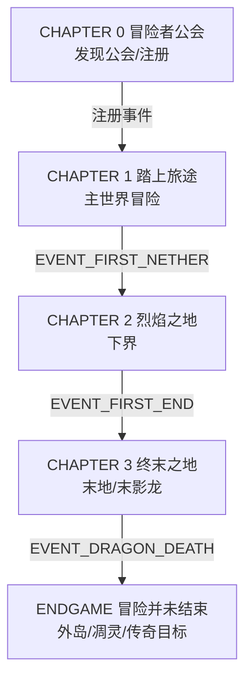
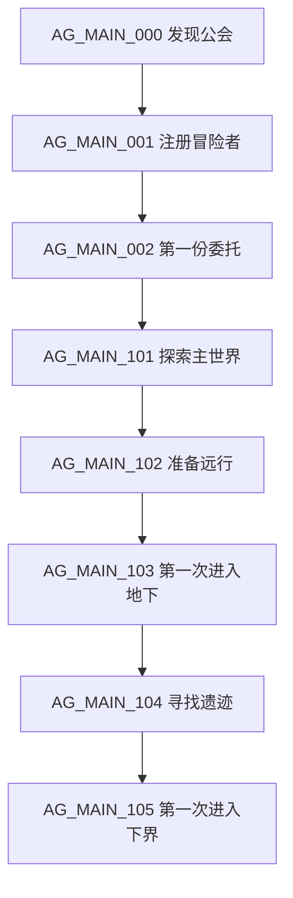

# 05 主线系统（弱线性）

## 设计原则

> 主线"识别玩家行为"，而不是"限制玩家行为"。

玩家可以提前进下界、提前找要塞、提前进末地、提前打龙。系统记录行为 → 事件 → 章节自动解锁 → 主线任务自动承认已完成部分。

## 章节结构图（Mermaid）

## 每章设计

| 章节 | 目标 | 核心体验 | 关键任务 | 事件 | Lore | 解锁 |
| --- | --- | --- | --- | --- | --- | --- |
| CHAPTER 0 | 引入公会 | 发现/注册/第一单 | AG_MAIN_000/001/002 | 发现公会、注册 | LORE_001/002 | 章节1、任务大厅 |
| CHAPTER 1 | 主世界冒险 | 探索/准备/下地底 | AG_MAIN_101-105 | 首次下界 | LORE_003-005 | 章节2 |
| CHAPTER 2 | 下界考验 | 生存/堡垒/烈焰棒/末影之眼 | AG_MAIN_201-208 | 堡垒/末影之眼/要塞/终末之门 | LORE_006-008 | 章节3 |
| CHAPTER 3 | 终末之战 | 龙战 | AG_MAIN_301-308 | 首进末地/龙攻击/龙死 | LORE_009-012 | Endgame |
| ENDGAME | 龙后世界 | 外岛/凋灵/传奇 | AG_END_001-024 | 外岛/凋灵/100任务 | 终末档案 | 持续 |

## 主线任务树（AG_MAIN，24 个）

（章节 2：201 下界生还 → 202 堡垒 → 203 烈焰棒 → 204 与格雷交谈 → 205 末地线索 → 206 末影之眼 → 207 要塞 → 208 终末之门；
章节 3：301 进入末地 → 302 观察龙 → 303 摧毁水晶 → 304 攻击龙 → 305 击杀龙 → 306 回到公会 → 307 与伊莱恩交谈 → 308 与塞拉斯交谈。）

## 主线任务策划模板（示例：AG_MAIN_105）

| 字段 | 内容 |
| --- | --- |
| ID / 名称 | AG_MAIN_105 / 第一次进入下界 |
| 类型 | MILESTONE（行为识别） |
| 目标 | 触发 EVENT_FIRST_NETHER |
| 前置 | 章节 2 解锁（注册后自动） |
| 完成条件 | 玩家实际进入下界即完成（接取时已进入则立即完成） |
| 奖励 | 0G / 60EXP / +25 声望（主线低金币原则） |
| 解锁 | 章节《烈焰之地》、远征 NPC 新对话 |
| 设计目的 | 把"去下界"从行为变成里程碑，承认玩家已经做到的事 |

## 为什么主线低金币、高 EXP/声望？

主线负责"意义与解锁"，不应变成刷钱渠道；资源收益交给支线，避免"主线即最优解"。

