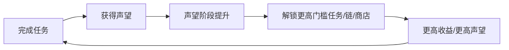

# 09 公会声望系统

## 声望阶段（V1.0 已实现）

| 阶段 | 门槛 | 阶段名 |
| --- | --- | --- |
| 0 | 0 | 陌生人 |
| 1 | 100 | 新人 |
| 2 | 300 | 可靠冒险者 |
| 3 | 800 | 公会成员 |
| 4 | 1500 | 精英冒险者 |
| 5 | 3000 | 公会名人 |

## 声望来源（V1.0 已实现）

- 完成任务：普通 +10、优秀 +15、稀有 +25、史诗 +40、传说 +60（随任务配置）
- 高品质/特殊任务额外声望

## 声望消耗（V1.0：无消耗；V1.2 计划：增加）

| 版本 | 消耗设计 |
| --- | --- |
| V1.0 已实现 | 无消耗，纯"累积 + 解锁" |
| V1.2 计划 | 声望商品（公会专属装备/补给）、声望服务（改名/装备维护） |

## 声望门槛与奖励（V1.0 已实现）

- 任务接取门槛：`min_reputation`（如公会试炼链 Lv3 需 800）
- 商店解锁：部分高级内容与阶段挂钩
- 任务链解锁：第三章"公会试炼"要求声望 800
- 称号：`reputation.adventurersguild.tier.*`

## 为什么"任务 → 声望 → 解锁 → 更高级任务"能形成长期循环？

1. **目标分层**：每 100/300/800/1500/3000 都有"下一个称号"目标
2. **与等级双轨**：等级=实力，声望=资历，两条成长线互相支撑
3. **门槛制造稀缺**：高端内容需要长期投入，防止速通
4. **叙事锚点**：阶段名（公会成员/公会名人）本身就是身份反馈

## 数据观察指标（V1.1 建议记录）

- 玩家平均到达阶段 3（800）所需天数
- 声望来源占比（普通任务 vs 高品质任务）
- 声望门槛对任务接取率的抑制比例

