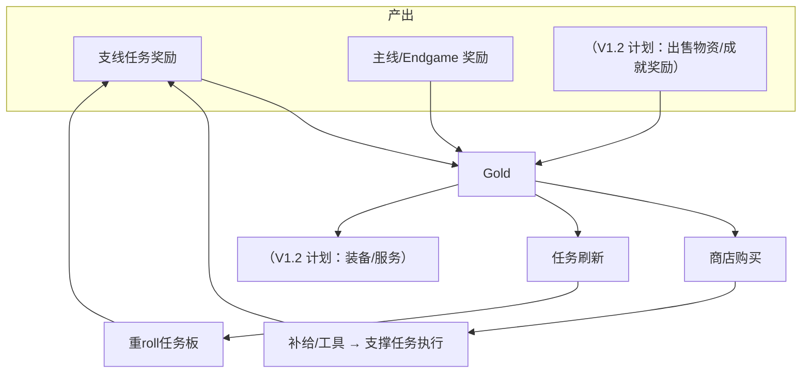

# 10 公会经济系统

## 经济循环图（Mermaid）

## Gold 产出（V1.0 已实现，实测数据）

- 80 任务奖励区间：0–500 Gold，均值约 52.8
- 每日任务板 6 任务平均日产出：约 300-400 Gold（视当日组合）

## Gold 消耗（V1.0 已实现）

- 商店：冒险补给（面包/火把/箭/木板）、高级补给（铁装/金苹果）、特殊商品（钻石装/末影珍珠）
- 刷新：免费 3 次/天 → 50/100/150/200

## 通货膨胀风险分析

| 风险 | 现状 | 缓解 |
| --- | --- | --- |
| 任务金币过量 | 均值 52.8/任务，日产出约 350 | 商店定价锚定（铁镐 120、钻石镐 600） |
| 刷新廉价 | 50 起递增 | 递增封顶 200，抑制无限重roll |
| 无持续消耗 | V1.0 消耗有限 | V1.2 计划：装备耐久维修/强化/声望商品 |
| 单人 vs 多人 | 经济按玩家隔离 | 无交易系统，天然无跨服通胀 |

## 金币上限与防作弊（已实现）

- 金币上限 1,000,000,000；拒绝负数/超限
- 购买：等级门槛 + 金币校验 + 背包满掉落

## V1.1 数值观察指标（建议）

1. 平均每日 Gold 收入 / 支出
2. 商店各商品购买频次（识别滞销品）
3. 玩家达到"钻石镐可负担"的时长（目标：10-20 小时）
4. 刷新使用次数分布（免费 vs 付费）

## 商店解锁设计

| 商店 | 解锁 | 定位 |
| --- | --- | --- |
| 冒险补给 | Lv1 | 生存必需品，低单价高流转 |
| 高级补给 | Lv3 | 中期装备，中等单价 |
| 特殊商品 | Lv5 | 后期消耗，高单价稀缺品 |

