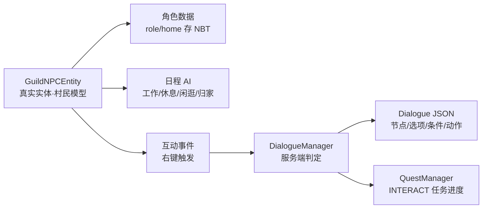

# 11 NPC 系统与数据驱动对白

## WHY：为什么需要一个 NPC 系统？

V1.0 的核心循环"接任务 → 做任务 → 领奖励"只依赖界面，玩家感觉不到"公会"是一个活着的组织。
V1.1 引入 NPC 的目的是给系统一个**反馈面**：

- 玩家做了任何事（注册、死亡、进下界、杀龙），世界要"有人知道"；
- 任务不是从空气里接的，而是从"人"那里接的；
- 成长不是数字跳动，而是 NPC 对你的称呼与态度变化。

设计上我们坚持一个原则：**NPC 是 MC 世界里真实存在的实体，不是纯 GUI**。
这决定了后面所有技术选型（实体、日程、对话、存档）都围绕"真实感"展开。

## WHAT：V1.1 已实现的 NPC 框架（V1.1 开发中，功能已完成）

### 自研轻量 NPC Framework



### 6 名核心 NPC（V1.1 已实现）

| 角色 ID | 姓名 | 职位 | 村民职业外观 | 站位（模板相对坐标） | 地毯标记 |
| --- | --- | --- | --- | --- | --- |
| receptionist | 艾琳 | 公会接待员 | Nitwit（无名者） | (23,2,22) 前台柜台后 | 白色 |
| questmaster | 罗德 | 任务管理员 | Librarian（图书管理员） | (36,2,16) 任务墙旁 | 黄色 |
| shopkeeper | 米娅 | 公会商人 | Weaponsmith（武器匠） | (34,2,25) 商店区 | 橙色 |
| expedition_master | 格雷 | 远征管理员 | Cartographer（制图师） | (10,2,8) 远征室 | 蓝色 |
| archivist | 伊莱恩 | 档案管理员 | Cleric（牧师） | (10,2,26) 档案室 | 紫色 |
| end_researcher | 塞拉斯 | 终末研究员 | Shepherd（牧羊人） | (18,2,8) 研究室 | 青色 |

> 现状说明：实体复用原版村民模型 + 职业外观区分（TASK-008），自定义皮肤属于 V1.2 计划。
> 头顶显示的是中文职位/姓名（`npc.adventurersguild.*` 语言键），按用户要求不用"标签"文字。

### 日程 AI（V1.1 已实现）

轻量日程目标（GuildScheduleGoal），按游戏时间切换状态：

```
06:00-08:00  空档
08:00-12:00  工作（站回岗位）
12:00-13:00  休息
13:00-18:00  工作（站回岗位）
18:00-22:00  自由闲逛（半径 12 格内随机走动）
22:00-06:00  归家（岗位）
任何时刻     距岗位 > 24 格 → 立即归家
```

同时保留原版 AI 的两个基础目标：**远离怪物**（10 格内躲避）与**注视玩家**（8 格），
让 NPC 在夜里或怪物靠近时有真实感，但**刻意跳过了村民原版大脑**（交易/职业刷新），
因为我们要的是"功能 NPC"，不是"会乱跑、会交易、会刷新职业的村民"。

### 数据驱动对白框架（V1.1 已实现）

每名 NPC 一个 `dialogues/*.json`，结构：

```json
{
  "id": "expedition_master",
  "npc": "expedition_master",
  "start": "start",
  "nodes": [
    { "id": "start", "text": "...", "choices": [
      { "text": "...", "conditions": [ { "type": "event", "value": "EVENT_FIRST_NETHER" } ], "next": "nether" }
    ]}
  ]
}
```

每个选项可带条件（服务端判定）与动作（服务端执行）：

| 条件类型 | 含义 | 已实现 |
| --- | --- | --- |
| chapter | 某章节已解锁 | 是 |
| quest | 某任务已完成 | 是 |
| event | 某世界事件已记录 | 是 |
| lore | 某档案已发现 | 是 |
| reputation | 声望 ≥ 阈值 | 是 |
| level | 等级 ≥ 阈值 | 是 |
| first_visit | 首次拜访该 NPC（计数器=0） | 是 |
| dimension | 玩家当前维度 | 是 |

| 动作类型 | 含义 | 已实现 |
| --- | --- | --- |
| unlock | 解锁内容标记 | 是 |
| start_quest | 直接接任务 | 是 |
| register | 注册冒险者 | 是 |
| open_screen | 打开对应界面 | 是 |
| record_event | 记录世界事件 | 是 |
| discover_lore | 发现档案 | 是 |
| give_reward | 发金币/EXP/声望 | 是 |

## HOW：玩家怎么与 NPC 互动？

1. 右键任意公会 NPC（原版村民基础交互被取消，改为公会交互）；
2. 服务端 `GuildNpcHandler` 记录一次拜访（`visit.<role>` 计数）+ 推进 INTERACT 任务进度；
3. `DialogueManager` 拉取该角色对话，服务端过滤可用选项后发给客户端；
4. 玩家选择 → C2S 包 → 服务端执行动作 / 跳转下一节点；
5. 对话可打开任务大厅、商店、档案等界面，形成"NPC 即入口"。

## DATA：数据规模（V1.1 已实现）

- 6 个对话文件、11 个对话节点、23 个可选分支；
- 事件条件出现在：格雷（EVENT_FIRST_NETHER / EVENT_DRAGON_DEATH）、塞拉斯（EVENT_DRAGON_DEATH）；
- 对话动作使用：register / open_screen(quests|chains|shop|adventurer|chronicle)；
- 每名 NPC 的拜访次数写入 Chronicle 计数器（`visit.<role>`），供 `first_visit` 条件与档案界面展示。

## IMPLEMENT：怎么落地？

- `entity/npc/GuildNpcEntity`：真实实体，role/home 存 NBT，`setPersistenceRequired()` 防止自然消失；
- `entity/npc/GuildNpcEntities`：6 个 EntityType 注册；
- `client/render/GuildNpcRenderer`：复用村民渲染，后续可叠加自定义皮肤；
- `npc/GuildNpcManager`：每个世界只生成一次（SavedData 标记），扫描地毯标记定位站位；
- `dialogue/DialogueManager`：全部条件/动作服务端执行，客户端只收到"当前节点文本 + 可选选项"；
- 互动入口：`PlayerInteractEvent.EntityInteract`（取消原版交易 UI）。

## VALUE：体现什么策划能力？

- **系统策划**：把一个"反馈面"拆成实体、日程、对话、任务四层，职责清晰；
- **任务策划**：INTERACT 任务类型让"找人说话"成为可量化目标（目标=角色，次数=数量）；
- **世界观**：6 个 NPC 用 6 个职业外观 + 中文姓名 + 事件对话构成"公会是个组织"的认知；
- **技术理解**：服务端权威对话（防客户端改条件）、实体持久化、事件驱动而非每 tick 扫描。

## V1.2 / V2.0 规划（未实现，仅规划）

- V1.2 计划：自定义 NPC 皮肤/模型、更多事件对话分支、对话文本滚动与打字机效果、NPC 好感度；
- V2.0 构想：NPC 每日台词随机池、节日事件对话、可雇佣 NPC 随队、地区性 NPC 声望。
