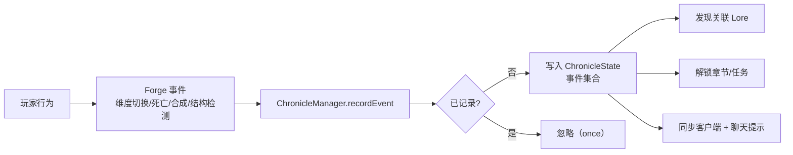

# 13 世界事件系统

## WHY：为什么要做世界事件？

任务系统的本质是"目标管理"，但玩家的**真实行为**（死了、进下界了、杀龙了）在原版里没有任何反馈。
世界事件系统把"玩家做了什么"变成游戏里的**一等公民**：

- 事件是一次性、服务端记录的行为事实；
- 事件驱动章节解锁、主线任务完成、档案发现、NPC 对话变化；
- 弱线性主线正是靠事件实现：**系统记录行为，而不是限制行为**。

## WHAT：15 个世界事件（V1.1 已实现，once=true）

| 事件 ID | 名称 | 触发条件（代码实现） | 关联 Lore | 关联章节 |
| --- | --- | --- | --- | --- |
| EVENT_GUILD_FOUND | 发现公会 | 公会放置完成（首次定位） | LORE_001 | 序章 |
| EVENT_GUILD_REGISTER | 成为冒险者 | 完成注册 | LORE_002 | 第一章 |
| EVENT_FIRST_DEATH | 第一次倒下 | 玩家死亡 | 无 | 无 |
| EVENT_FIRST_NETHER | 踏入下界 | 维度切换到下界 | LORE_003 | 第二章 |
| EVENT_NETHER_FORTRESS | 发现下界堡垒 | 在下界身处堡垒结构内（每 5 秒低频检测） | LORE_005 | 第二章 |
| EVENT_FIRST_ENDER_EYE | 合成末影之眼 | 合成末影之眼 | LORE_004 | 第二章 |
| EVENT_STRONGHOLD_FOUND | 发现要塞 | 主世界身处要塞结构内（每 5 秒低频检测） | LORE_008 | 第二章 |
| EVENT_END_PORTAL_OPEN | 开启终末之门 | 维度切换到末地（自动附带记录） | 无 | 第三章 |
| EVENT_FIRST_END | 踏入末地 | 维度切换到末地 | LORE_006 | 第三章 |
| EVENT_FIRST_DRAGON_ATTACK | 直面末影龙 | 玩家被龙攻击 | 无 | 第三章 |
| EVENT_DRAGON_DEATH | 击败末影龙 | 龙死亡且击杀者为玩家 | LORE_007 | Endgame |
| EVENT_WITHER_SUMMON | 召唤凋灵 | 凋灵实体加入世界 | LORE_009 | Endgame |
| EVENT_WITHER_DEATH | 击败凋灵 | 凋灵死亡且击杀者为玩家 | 无 | Endgame |
| EVENT_END_ISLAND | 抵达外岛 | 末地中 x 或 z 绝对值大于 800（每 5 秒低频检测） | LORE_010 | Endgame |
| EVENT_100_QUESTS | 完成百次委托 | 完成任务计数达到 100 | LORE_012 | Endgame |

## HOW：事件怎么工作？

设计要点：

1. **once=true**：同一个事件只记录一次，防重复刷奖励；
2. **提前完成自动记录**：玩家没接任务就杀了龙？事件照样记录，主线里程碑任务接取后自动判定完成（弱线性）；
3. **双级记录**：玩家级（ChronicleState）+ 世界级（GuildWorldData.worldEvents），前者管个人进度，后者管世界状态；
4. **事件即解锁**：章节解锁条件、对话选项条件、Lore 发现条件全部引用事件 ID；
5. **低频结构检测**：堡垒/要塞/外岛用每 5 秒一次的结构/坐标检测，不逐 tick 扫描。

## DATA：事件数据

事件定义在代码常量（ChronicleManager）+ Excel WorldEvent 表；Lore 的 `unlock_event` 字段把事件与档案关联。
事件本身不配奖励数值——奖励由**引用该事件的里程碑任务**发放，避免双轨数值。

## IMPLEMENT：怎么落地？

- `chronicle/ChronicleEvents`：7 类 Forge 事件处理器 + 1 个低频 Tick 检测；
- `chronicle/ChronicleManager`：记录/去重/Lore 联动/同步；
- `player/ChronicleState`：玩家事件集合（NBT 持久化）；
- `guild/GuildWorldData`：世界级事件集合（SavedData）；
- `chapter/ChapterManager`：事件驱动章节解锁；
- 里程碑任务：`objective.target = 事件 ID`，接取时若事件已存在则自动完成。

## VALUE：体现什么策划能力？

- **系统设计**：把"行为反馈"做成统一的事件总线，章节/任务/对话/Lore 全部挂接，避免各自为政；
- **叙事设计**："世界知道玩家做了什么"是低成本高感知的叙事手法；
- **弱线性主线**：事件记录型判定是"不限制玩家"的落地答案；
- **性能意识**：只有 3 类检测需要定时轮询（5 秒一次），其余全部事件驱动。

