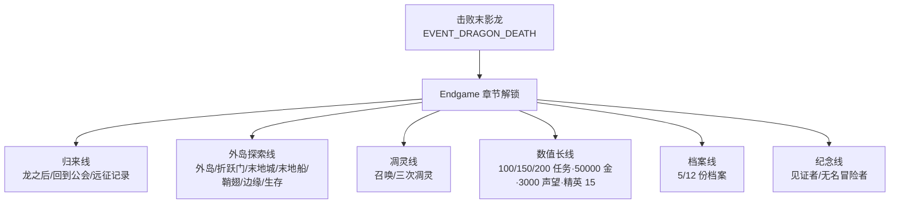

# 16 Endgame 系统

## WHY：为什么末影龙不是终点？

原版流程在击杀末影龙后进入"自由发挥"，多数玩家此时退坑或转向建筑/红石。
Adventurer's Guild 把"龙之后"做成一个**独立内容阶段**，理由有三：

1. 玩家已经投入了完整主线（主世界 → 下界 → 末地），突然中断很可惜；
2. 末地外岛/鞘翅/凋灵这些原版内容缺少"目标包装"，玩家不知道下一步该做什么；
3. 数值长线（200 任务、50000 金币、3000 声望）需要一个"为什么继续"的答案。

## WHAT：Endgame 内容矩阵（V1.1 已实现，24 个任务）

Endgame 章节在 `EVENT_DRAGON_DEATH` 后解锁，24 个 AG_END_* 任务分 6 条线：

### 内容矩阵（按任务）

| 任务 | 内容 | 解锁 | 玩法 | 目标 | 奖励（EXP/声望） | 重复价值 | 设计目的 |
| --- | --- | --- | --- | --- | --- | --- | --- |
| AG_END_001 龙之后 | 主线收束 | 龙死 | 回公会 | 事件记录 | 100/30 | 无 | 明确"进入新阶段" |
| AG_END_002 破碎的边界 | 末地水晶 | 龙死 | 摧毁水晶 | 4 颗 | 100/30 | 无 | 让"龙之后末地"有意义 |
| AG_END_003 外岛远征 | 外岛 | 龙死 | 抵达外岛 | 事件 | 100/30 | 无 | 引导外岛（原版无引导） |
| AG_END_004 第一个折跃门 | 折跃门 | 外岛后 | 与格雷对话 | 1 次 | 60/20 | 无 | 叙事接线 |
| AG_END_005 末地城 | 末地城 | 龙死 | 探索 end_midlands | 抵达 | 120/40 | 每世界一次 | 探索引导 |
| AG_END_006 船上的秘密 | 末地船 | 龙死 | 探索 end_highlands | 抵达 | 120/40 | 每世界一次 | 探索引导 |
| AG_END_007 获取鞘翅 | 鞘翅 | 龙死 | 收集 | 1 件 | 150/50 | 无 | 装备目标 |
| AG_END_008/009 回公会/远征记录 | 汇报 | 龙死后 | 与罗德/伊莱恩对话 | 各 1 次 | 60/20 | 无 | 叙事闭环 |
| AG_END_010/011 凋灵 | 凋灵 | 龙死 | 召唤/击杀 | 1 次/3 只 | 120/40, 200/60 | 击杀有计数 | 下一位 BOSS |
| AG_END_012 传奇猎手 | 精英 | 龙死 | 精英讨伐累计 | 15 只 | 200/60 | 长期 | 战斗长线 |
| AG_END_013/020/024 100/150/200 任务 | 任务数 | 龙死 | 做任务 | 100/150/200 | 300/80, 400/100, 500/150 | 长期 | 任务系统终局目标 |
| AG_END_014 50000 Gold | 财富 | 龙死 | 经济积累 | 50000 金 | 300/80 | 长期 | 经济长线 |
| AG_END_015 公会名人 | 声望 | 龙死 | 声望积累 | 3000 | 300/80 | 长期 | 声望长线 |
| AG_END_016/022 档案 | 档案收集 | 龙死 | 触发事件收集 | 5/12 份 | 120/40, 200/60 | 无 | 把 Lore 变目标 |
| AG_END_017 世界边缘 | 末地荒地 | 龙死 | 探索 end_barrens | 抵达 | 120/40 | 每世界一次 | 探索引导 |
| AG_END_018 终末档案 | 塞拉斯 | 龙死 | 对话 | 1 次 | 60/20 | 无 | 世界观收束 |
| AG_END_019 最后的远征 | 末地生存 | 龙死 | 末地存活 | 120 秒 | 200/60 | 每次不同 | 生存验证 |
| AG_END_021 无名冒险者 | 回访 | 龙死 | 找艾琳 | 1 次 | 60/20 | 无 | 首尾呼应 |
| AG_END_023 见证者 | 龙 | 龙死 | 击杀记录 | 1 次 | 150/50 | 每世界一次 | 纪念击杀 |

## HOW：Endgame 怎么解锁与推进？

1. 击杀末影龙 → 世界事件 `EVENT_DRAGON_DEATH` → Endgame 章节自动解锁；
2. 24 个任务不需要按顺序：探索/对话/收集/长线成就并行推进；
3. 任务类型复用主线的判定机制（MILESTONE/INTERACT/EXPLORE/SURVIVE/COLLECT/ACHIEVEMENT），
   零新增判定逻辑——这是"任务系统可承载任何阶段内容"的直接证据；
4. 部分任务接取时若条件已满足会自动完成（如已经杀了 3 只凋灵再接"三次凋灵"直接发奖）。

## DATA：数值概览（V1.1 已实现）

- 24 个任务：MILESTONE×3 / INTERACT×5 / EXPLORE×3 / ACHIEVEMENT×11 / COLLECT×1 / SURVIVE×1；
- 品质：RARE×5 / EPIC×8 / LEGENDARY×11（高难内容集中在高倍率）；
- 奖励均值：EXP≈171、声望≈51（高于主线，匹配"终局难度"）；
- 最高单任务：AG_END_024（500 金币 / 500 EXP / 150 声望）。

## IMPLEMENT：怎么落地？

- `chapters/endgame.json`：unlock=EVENT_DRAGON_DEATH，引用 24 个任务；
- `quests/ag_end_*.json`：数据驱动，判定复用 QuestManager；
- 计数器（dragonKills/witherKills/eliteKills/endCrystals/loreCount/completed/gold）写入 ChronicleState；
- 长线成就通过 `statValue`（完成数/金币/声望/档案数）实时判定。

## VALUE：体现什么策划能力？

- **内容规划**：把"龙之后"拆成 6 条线，覆盖探索/战斗/经济/声望/收集/叙事六种玩家动机；
- **数值设计**：长线目标（200 任务 / 50000 金 / 3000 声望）与成长曲线、任务产量对齐；
- **系统复用**：Endgame 不新增判定系统，证明底层任务框架的扩展性；
- **运营思维**：Endgame 是"留存设计"，给每个玩家一个继续上线玩原版的理由。

## V1.2 / V2.0 规划（未实现，仅规划）

- V1.2 计划：Endgame 隐藏任务链（凋灵线收束）、龙鳞/凋灵骷髅头的专属遗物掉落；
- V2.0 构想：大型副本（末地城远征队）、Boss 竞技场、公会传奇排行。
