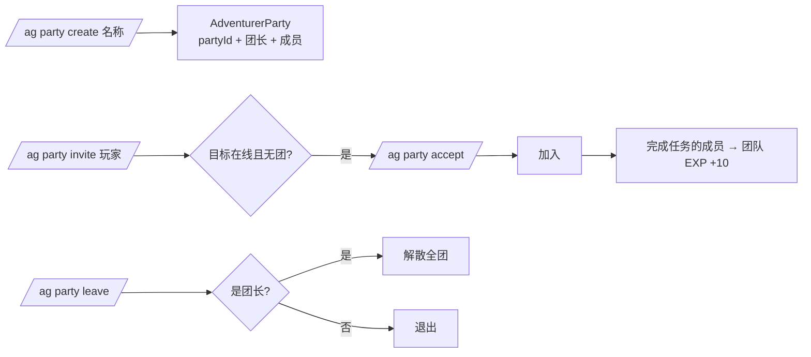

# 17 冒险团系统（Adventurer Party）

## WHY：为什么 V1.1 做"轻量冒险团"而不是复杂公会？

玩家在 MC 里天然会组队玩，但原版组队没有任何"共同身份"。
冒险团给一起玩的玩家一个**共享容器**：一个名字、一个等级、一份共同记录。

但同时，V1.1 的边界是明确的——**不做复杂 MMO Guild**：

- 不做公会领地/建筑权/税收等重型玩法（那是 V2.0 的构想）；
- 不做职业/队伍战斗同步（AI 队友、仇恨同步成本极高，超出 V1.1 范围）；
- 不做成员间交易/共享背包（会引出大量反作弊问题）。

原因：V1.1 的核心目标是"验证冒险团作为共享身份与进度容器"，
先把**创建/邀请/加入/退出/解散/团长**这六个最小闭环做扎实，而不是堆一堆半成品。

## WHAT：冒险团功能（V1.1 已实现）

### 数据结构（GuildWorldData SavedData 持久化）

| 字段 | 说明 |
| --- | --- |
| partyId | 唯一 ID（`party_` + 随机 8 位） |
| name | 团名（玩家命名） |
| leader | 团长 UUID |
| members | 成员 UUID 列表 |
| level / experience | 团队等级与 EXP（完成任务 +10） |
| completedQuests / reputation | 团队累计任务数与声望展示 |

### 命令

`/ag party create <名称>` / `invite <玩家>` / `join <party_id>` / `accept` / `leave` / `disband` / `info`

### 交互边界（服务端校验）

- 已在团中 → 不能重复建团/入团；
- 只有团长能邀请/解散；团长离开 = 解散全团（V1.1 简化规则）；
- 邀请只发给在线玩家；目标离线/已在团 → 拒绝并提示；
- 团队数据写入世界 SavedData，重启后仍存在。

## HOW：玩家怎么用？

1. 团长：`/ag party create 远征队`；
2. 团长：`/ag party invite 队友名`，对方收到邀请提示；
3. 队友：`/ag party accept` 加入；
4. 任意成员完成任务 → 团队 EXP +10，团队等级成长；
5. `G` 键公会总览与冒险团界面（PartyScreen）显示团名/成员/等级；
6. 团长 `/ag party disband` 解散；成员 `/ag party leave` 退出（团长退出=解散）。

## DATA：为什么团队数据放世界级 SavedData？

团队是"世界里的组织"，不是玩家个人属性：放在 `GuildWorldData.parties` 里，
任何成员都能查到全团状态；玩家侧只存 `partyId` 引用（AdventurerData NBT）。
这样换团长、离线成员、服务器重启都不会丢数据。

## IMPLEMENT：怎么落地？

- `party/PartyManager`：全部服务端权威操作 + 校验；
- `party/AdventurerParty`：领域模型（save/load 到 NBT）；
- `party/PartyReference`：玩家侧引用；
- `guild/GuildWorldData`：团队注册表（SavedData）；
- `network/PartyDataSyncPacket` + `GuildDataSyncPacket`：成员状态同步；
- `client/screen/PartyScreen` + `client/ClientPartyData`：客户端展示；
- 团队 EXP 钩子：`QuestManager` 完成任务时调用 `PartyManager.onQuestCompleted`。

## VALUE：体现什么策划能力？

- **范围控制**：明确"为什么只做六个操作"，拒绝功能堆砌；
- **多人设计**：邀请/入团/退团/解散的完整状态机与边界校验；
- **数据设计**：区分"玩家属性"与"世界组织"，选对持久化层级；
- **合作向策划**：团队 EXP 是第一个"一起玩有共同成长"的钩子，为 V2.0 组队玩法留接口。

## V1.2 / V2.0 规划（未实现，仅规划）

- V1.2 计划：团长转让、团队成员任务共享进度（同任务一起做都计数）、团队专属任务；
- V2.0 构想：团队领地、团队副本、团队声望排行、跨服团队。
