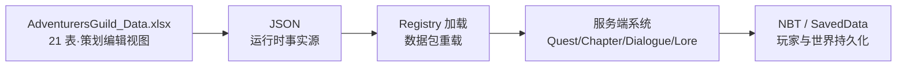

# 20 数据表设计

## WHY：为什么数据驱动？

任务/NPC/对话/事件/Lore 全走 JSON + Excel，开发时不写死任何内容：

- 策划改数值**不需要改代码**，重载数据包即生效；
- 一份 Excel 配表（21 表）是策划与程序之间的**事实契约**；
- 运行时只读 JSON（打包进 jar），Excel 是编辑/审查界面——"一个事实源，两个视图"。

## 配表总览（V1.1 已实现）

`data/AdventurersGuild_Data.xlsx` 共 21 个工作表；运行时数据在
`src/main/resources/data/adventurersguild/*/*.json`。两者字段一一对应。

| # | 表 | 运行时 JSON | 对应 Master Prompt 需求 |
| --- | --- | --- | --- |
| 1 | Quest | quests/*.json | Quest 表 |
| 2 | QuestPool | quest_pools/daily.json | 每日任务池 |
| 3 | QuestChain | quest_chains/*.json | 任务链 |
| 4 | Level | LevelData（代码曲线） | 等级曲线 |
| 5 | Reputation | ReputationData（代码曲线） | 声望曲线 |
| 6 | Equipment | equipment/*.json | 装备表 |
| 7 | Shop | shops/*.json | 商店表 |
| 8 | Economy | 代码+Balance | 经济表 |
| 9 | TestData | —（验证清单） | 测试记录 |
| 10 | QuestReward | QuestQuality（代码） | 奖励倍率 |
| 11 | QuestCondition | DialogueCondition（代码） | 条件类型 |
| 12 | Chapter | chapters/*.json | 章节表 |
| 13 | Milestone | 事件→章节映射 | 里程碑 |
| 14 | NPC | npc 注册+对话 | NPC 表 |
| 15 | WorldEvent | ChronicleManager 常量 | 事件表 |
| 16 | Lore | lore/*.json | Lore 表 |
| 17 | Party | AdventurerParty | 冒险团字段 |
| 18 | Unlock | UnlockState | 解锁表 |
| 19 | Balance | 代码常量 | 平衡参数 |
| 20 | UI | client/screen | UI 清单 |
| 21 | Achievement | ag_end_*.json | 成就目标 |

## 关键表字段定义（可直接交给程序使用）

### Quest（80 行）

| 字段 | 类型 | 说明 | 示例 |
| --- | --- | --- | --- |
| quest_id | string | 唯一 ID | AG_MAIN_105 |
| type | enum | COLLECT/HUNT/EXPLORE/SURVIVE/TRANSPORT/ELITE/INTERACT/MILESTONE/ACHIEVEMENT | MILESTONE |
| quality | enum | COMMON/UNCOMMON/RARE/EPIC/LEGENDARY | RARE |
| title_key / description_key | lang key | 中英双语 | quest.adventurersguild.* |
| objective_target | string | 物品/实体/群系/维度/事件/计数器 | EVENT_FIRST_NETHER |
| objective_amount | int | 数量（SURVIVE 为秒数） | 1 |
| objective_extra / radius | string/int | SURVIVE 条件、TRANSPORT 送达 | dimension |
| reward_gold/exp/reputation | int | 基础奖励（×品质×装备） | 0/60/25 |
| recommended_level | int | 展示用推荐等级 | 2 |
| min_level / min_reputation | int | 接取门槛 | 1/0 |
| time_limit_seconds | int | 0=无限时 | 0 |
| tutorial | bool | 新手置顶任务 | false |

### QuestPool（22 行）

`pool_id | quest_id | weight | min_level | max_level`
权重制抽取：每日板按品质槽位 + 权重抽取，等级范围过滤玩家不可接任务。

### QuestChain（3 链 × 5 步）

`chain_id | step | quest_id | unlock_type | unlock_value | title_key`
step 0 用 level/reputation 解锁；后续步骤由链进度自动推进。

### Level / Reputation（曲线表）

- Level：`level | total_exp_required | exp_to_reach_next | title_key`
- Reputation：`tier | threshold | title_key | unlock_notes`

### Equipment（5 行）

`id | item | slot | effect | value | description_key`
effect 枚举：quest_exp / gold_reward / mining_speed / hostile_damage / move_speed。

### Shop（3 店 14 商品）

`shop_id | title_key | category | item | count | price | min_level`
补给 4 件（Lv1）、装备 5 件（Lv3）、特殊 5 件（Lv5）。

### WorldEvent（15 行）

`event_id | 名称 | 说明`；触发逻辑在代码（ChronicleEvents），once=true。

### Lore（12 行）

`lore_id | title_key | unlock_event`；文本在 lang 文件，事件自动发现。

### Chapter（5 行）

`chapter_id | title_key | unlock_type | unlock_value | quest_count`
unlock_type=event 时 value 为事件 ID（chapter_0 空值=默认解锁）。

### Unlock（解锁矩阵）

`key | 来源 | 用途`；运行时 UnlockState 存 `chapter.*` 等标记，服务器权威。

### Balance（平衡参数）

`项目 | 数值 | 说明`：同时任务上限 3、每日免费刷新 3 次、付费刷新 50/100/150/200 等。

### UI（10 页清单）

`页面 | 快捷键 | 说明`：GuildMain(G) / QuestBoard(J) / Adventurer(K 信息) / Chronicle(K 档案) / ...

### Achievement（终局成就目标）

`quest_id | target | threshold`：completed=100/150/200、gold=50000、reputation=3000、
loreCount=5/12、witherKills=3、eliteKills=15、endCrystals=4、dragonKills=1。

## 数据流向

## IMPLEMENT：怎么落地？

- `data/*Registry`：8 个注册器负责 JSON 加载与按 ID 查询；
- `GuildDataLoader`：数据包重载时刷新（改 JSON 不用重启游戏）；
- Excel 21 表与 JSON 同构，导出时逐行校验（字段名一致，防"策划改表程序不知道"）。

## VALUE：体现什么策划能力？

- **数据建模**：字段粒度（quest/objective/reward 分离）可直接转程序；
- **协作契约**：Excel=人读，JSON=机读，一个事实源；
- **扩展性**：加任务=加 JSON 行，加事件=加常量+表行，系统零改动；
- **文档纪律**：字段示例+枚举全列出，招聘方可直接评估"数值/系统策划基本功"。
