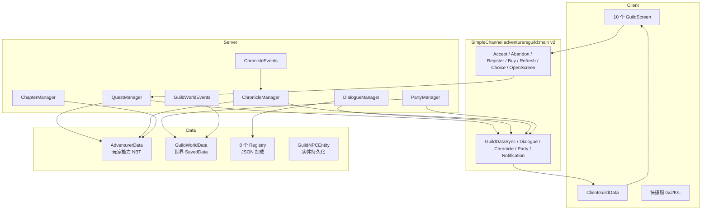

# 21 技术架构

## WHY：策划为什么要懂技术架构？

任何系统设计最终都要"落成代码"。本项目的架构原则是：

- **服务端权威**：一切状态与奖励由服务端判定，客户端只是"遥控器+显示器"；
- **数据驱动**：内容（任务/NPC/对话/事件）全部来自 JSON，代码只提供规则；
- **事件驱动**：只在"行为发生"时处理，不为不存在的问题付性能成本；
- **不过度工程化**：用 Forge 原生能力（Capability/SavedData/SimpleChannel/EventBus），
  不引入数据库、HTTP、DI 框架。

## 系统架构图（V1.1 已实现）



## 模块职责（对应包结构）

| 包/模块 | 关键类 | 职责 |
| --- | --- | --- |
| quest | QuestManager（服务端权威） | 接/弃/进度/完成/发奖/刷新/链/章节门槛 |
| player | AdventurerData + Profile/QuestState/ChronicleState/UnlockState/PartyReference | 玩家数据分层视图（NBT） |
| chapter | ChapterManager / MilestoneManager | 章节解锁与完成判定 |
| chronicle | ChronicleManager / ChronicleEvents | 15 事件记录、Lore 联动 |
| dialogue | DialogueManager / Dialogue* | 对话状态机（条件/动作服务端执行） |
| party | PartyManager / AdventurerParty | 冒险团生命周期 |
| guild | GuildWorldData | 世界级公会数据（SavedData） |
| world | GuildWorldEvents | 公会建筑地表生成 + 地形清理 + 补门 |
| entity/npc | GuildNpcEntity / GuildNpcEntities | 6 NPC 真实实体 + 日程 AI |
| data | 8 个 Registry + DailyBoardManager | JSON 加载、每日板 |
| economy/equipment | Shop / EquipmentEffects | 商店与饰品（Curios 软集成） |
| network | GuildNetwork + 12 包 | 协议 v2 |
| command | AGCommands | `/ag` 全部指令 |
| client | 10 界面 + ClientGuildData + 键位 | 渲染与请求 |

## 核心数据流：接任务

```
QuestBoardScreen [接受]
  → AcceptQuestPacket (C2S)
  → QuestManager.acceptQuest
  → 校验：注册 / 存在 / 未重复 / 槽位 / 等级 / 声望 / 章节 / 前置 / 上板
  → AdventurerData.acceptQuest(quest, gameTime)
  → MILESTONE/ACHIEVEMENT 已满足则自动完成发奖
  → GuildDataSyncPacket (S2C) 刷新客户端
```

## 核心数据流：事件 → 世界反馈

```
玩家进入下界
  → PlayerChangedDimensionEvent
  → ChronicleManager.recordEvent(EVENT_FIRST_NETHER)
  → Lore LORE_003 自动发现
  → Chapter 2 解锁（ChapterManager）
  → 对话选项解锁（格雷的"关于下界的远征"）
  → 里程碑任务 AG_MAIN_105 接取即完成
```

## 持久化分层

| 层 | 机制 | 内容 |
| --- | --- | --- |
| 玩家 | Capability + NBT | 等级/金币/声望/任务/事件/档案/计数器/解锁/partyId |
| 世界 | SavedData（GuildWorldData） | 公会坐标/NPC 标记/世界事件/全局档案/团队 |
| 实体 | NBT | NPC role/home，`setPersistenceRequired` |
| 配置 | JSON（随 jar 打包） | 任务/池/链/商店/装备/对话/Lore/章节 |

## 策划如何落成代码（映射示例）

| 策划需求 | 落地 |
| --- | --- |
| "新增一个任务" | 加一个 quest JSON + lang 条目 |
| "新增品质倍率" | 改 QuestQuality 枚举值（一行） |
| "新事件解锁新对话" | 加事件常量 + 对话 choice 加 condition |
| "新章节" | chapters JSON + 事件映射 |
| "新 NPC" | 注册实体 + 对话 JSON + 站位/地毯 |
| "新商店" | shops JSON |

## VALUE：体现什么策划能力？

- **跨程序沟通**：能把系统需求翻译成模块/数据流/持久化方案；
- **架构思维**：明确"服务端权威、数据驱动、事件驱动"三条红线贯穿全文；
- **工程可落地**：每个系统都有对应的类/文件/数据流，不是空中楼阁。

## 技术债（诚实记录）

- 无 git 仓库；无自动化测试（compileTestJava NO-SOURCE）；
- GuildDataSyncPacket 为聚合大包（V1.2 建议拆 Quest/Adventurer/Dialogue 独立快照）；
- `FMLJavaModLoadingContext.get()` 弃用警告（1.20.1 标准用法，非阻塞）；
- Curios 反射链依赖 API 形状（有兜底，未在真实 Curios 环境回归）。
