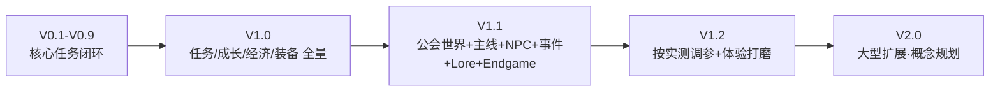

# 24 版本规划

## 版本路线图（V0.1 → V2.0）

| 版本 | 状态 | 内容 | 证据 |
| --- | --- | --- | --- |
| V0.1–V0.9 | 已实现（历史迭代） | 任务系统从"接任务"起步：COLLECT/HUNT → EXPLORE/SURVIVE → TRANSPORT/ELITE，逐步加入每日板/品质/门槛/商店/装备/任务链/新手引导 | 代码注释 + docs/architecture、quest_system |
| V1.0 | 已实现 | 32 任务、6 类型、5 品质、每日板、Lv1–6、声望 6 阶段、3 商店、5 饰品、任务链、中英双语 UI | build 产物 1.0.0，服务器冒烟 PASS |
| V1.1 | 开发中（功能已完成，验证进行中） | 6 NPC 实体+日程+对话、15 世界事件、12 Lore、5 章节、24 主线+24 Endgame、冒险团、Chronicle、10 界面、协议 v2、公会建筑地表生成 | 代码 86 文件/7176 行；构建 PASS |
| V1.2 | 计划 | 按真实测试调参（完成率/刷新率/升级天数）；UI 打磨（字体/动画/Toast）；自定义 NPC 皮肤；GuildDataSync 拆包；声望消耗渠道；EXPLORE 标签匹配；TRANSPORT 目标改公会坐标 | 本文档 19/18/22 章中的观察指标与改进点 |
| V2.0 | 构想（概念规划） | 更多公会/地区声望、公会建筑升级、职业系统、大型副本、公会领地、组队任务共享、NPC 雇佣、节日事件 | 仅概念，不假装实现 |

## V1.0：任务系统基础版本（已实现）

**目标**：验证"注册→接任务→执行→完成→奖励→保存"完整闭环。

- 数据驱动：任务/池/链/商店/装备全部 JSON；
- 服务器权威：所有判定在 QuestManager；
- 持久化：玩家 NBT + 每日板 SavedData；
- 交付：1.0.0 jar，专用服务器冒烟 PASS。

## V1.1：完整公会世界（开发中，功能已完成）

**目标**：从"任务 Mod"升级为"以原版主世界→下界→末地为主线、公会是枢纽的 RPG 冒险体验"。

已交付：

- 公会建筑真实生成（地表/清地形/补门/留空档）+ 坐标持久化；
- 6 名 NPC 实体 + 日程 AI + 数据驱动对话（条件/动作服务端执行）；
- 15 世界事件（once）+ 12 Lore + 5 章节（弱线性）；
- 24 主线 + 24 Endgame 任务；
- 冒险团（创建/邀请/加入/退出/解散）+ Chronicle + Party UI；
- 10 页面深木/羊皮纸主题 UI + G/J/K/L 快捷键；
- 网络协议 v2（12 包）。

待完成/验证：

- 真实游玩回归（用户正在 Java 版实测，TestData 表回填）；
- 多人（2/5/10 人）联机验证；
- Curios 真实环境回归；
- 建筑/NPC 多世界回归（新世界 2 手动改造模板的兼容验证）。

## V1.2：按实测打磨（计划）

依据 19 章观察指标决定：

| 指标 | 若偏离 | 调整方向 |
| --- | --- | --- |
| 每日板完成率 <60% | 目标量/限时过严 | 降数量、延时限 |
| 付费刷新使用 >2 次/人/天 | 免费次数过少 | 免费 +1 或降价 |
| Lv6 达成 >30 小时 | 曲线过陡 | 下调 3500 段 |
| 声望 800 达成率过低 | 链门槛过高 | 降到 500 或加声望来源 |

另含：GuildDataSync 拆包、NPC 自定义皮肤、UI 动画/字体、声望消耗渠道、
EXPLORE 标签匹配、TRANSPORT 送达目标改公会坐标。

## V2.0：大型扩展（构想，概念规划）

- 多公会/地区声望：不同地区的公会与任务生态；
- 公会建筑升级：大厅扩建、装修随声望变化；
- 职业系统：冒险者职业分支与专属任务；
- 大型副本：末地城远征队、Boss 竞技场；
- 组队任务共享：同队玩家共享任务进度；
- NPC 雇佣：随队冒险与支援；
- 大型世界事件：周期性公会活动。

> 以上全部为概念方向，未写代码；版本规划的意义是让招聘方看到"知道往哪走，也分得清什么是现状"。

## VALUE：体现什么策划能力？

- **版本管理**：每个版本有明确目标、交付物与验收口径；
- **渐进式开发**：先闭环、再世界、再打磨、再扩展，不一口吃成胖子；
- **诚实标注**：V1.1 写"开发中/验证中"，V2.0 写"构想"，不混淆现状与规划。
