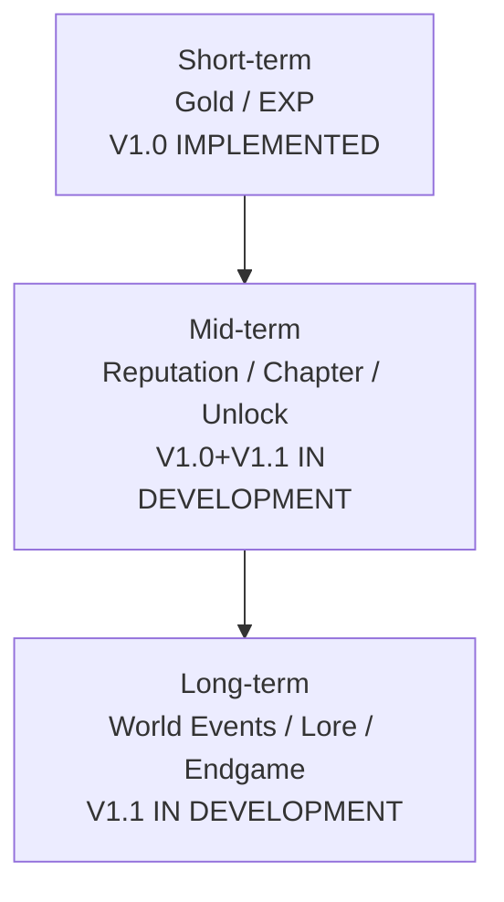
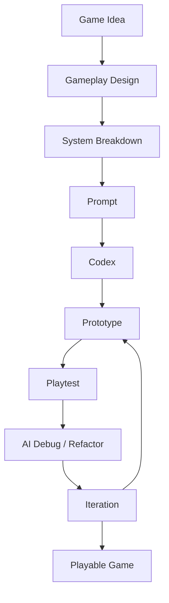

# Adventurer's Guild — 招聘版作品集（16 页内容设计）

> 定位：**AI Vibe Coding × Game Design × Playable Prototype**
> 目标岗位：游戏 AI 策划 / AI Game Planner / AI Prototype Developer
> 数据等级：VERIFIED（本次重扫）/ IMPLEMENTED（V1.0）/ IN DEVELOPMENT（V1.1）/ PLANNED（V1.2）/ CONCEPT（V2.0）

---

## PAGE 01 — COVER

**核心信息**：

```text
ADVENTURER'S GUILD
AI Vibe Coding × Game Design
Minecraft 1.20.1 · Playable Game Prototype
Game Designer / AI Prototype Developer
```

**主视觉**：公会大厅全景真实游戏截图——**已有**：`assets/AG_01_guild_hall.png`（备选 `AG_13_hall_interior.png`）。

**辅助信息（3 条）**：

- 80 个数据驱动任务（VERIFIED）
- 6 名 NPC + 数据驱动对白（V1.1 IN DEVELOPMENT）
- 5 章节主线：主世界 → 下界 → 末地 → Endgame（V1.1 IN DEVELOPMENT）

---

## PAGE 02 — PROJECT SNAPSHOT

**标题**：I Built a Playable Game Prototype

**大型数据卡（全部 VERIFIED，2026-08-19 重扫）**：

| 数据卡 | 数值 | 等级 |
| --- | --- | --- |
| Java Files | 86 | VERIFIED |
| Java LOC | 7,176 | VERIFIED |
| Quests | 80（9 类型 × 5 品质） | VERIFIED |
| Chapters | 5 | VERIFIED |
| Dialogues | 6（11 节点 / 23 分支） | VERIFIED |
| Lore | 12 | VERIFIED |
| Quest Chains | 3 | VERIFIED |
| Quest Pool | 22 条目 | VERIFIED |
| Equipment | 5 饰品 | VERIFIED |
| Data Sheets | 21 工作表 | VERIFIED |
| Build | PASS（TASK-026/030 记录；2026-08-16 审计 PASS） | VERIFIED* |

> *Build 说明：最近一次完整构建 PASS 记录于任务报告与项目审计；本次交付复验时本机 Gradle 原生缓存被占用（环境问题，非代码问题）。

**核心观点**：这不是一份策划案，而是一个能构建、能进游戏、能存档的 Prototype。

---

## PAGE 03 — WHY THIS GAME?

**标题**：Why Adventurer's Guild?

**问题（玩家体验视角）**：

```text
Minecraft：探索 → 战斗 → 生存 → 建造（自由度极高，但缺少持续的任务驱动）
Adventurer's Guild：探索 → 任务目标 → 风险判断 → 冒险 → 奖励 → 成长 → 新目标
```

**核心观点**：我不是给 Minecraft 增加更多内容，而是增加一层 **Adventure Layer**——把玩家本来就愿意做的事（下矿、狩猎、跑图、下界远征）变成有目标、有判断、有回应的冒险。

**辅助信息（4 条）**：

- 任务 = 目标包装（把"探索"变成"沙漠远征"）——VERIFIED
- 风险/收益 = 品质与限时（RARE×2 但限时 60 分钟）——VERIFIED
- 世界回应 = 15 世界事件（进了下界，NPC 会知道）——V1.1 IN DEVELOPMENT
- 成长方向 = 等级/声望/章节/Endgame 四层——VERIFIED / IN DEVELOPMENT

---

## PAGE 04 — GAMEPLAY LOOP

**标题**：From Quest to Adventure

**图形化循环（Mermaid）**：


**辅助信息**：

- 每次循环的产出：金币（经济）、EXP（成长）、声望（身份）——VERIFIED
- 解锁：新品质槽/新任务链/新章节/Endgame——VERIFIED / IN DEVELOPMENT
- 一次任务的价值不只在奖励，而在"下一阶段能看到什么"——设计主张

---

## PAGE 05 — CASE STUDY 01｜Quest = Player Decision

**标题**：Quest = Player Decision

**选用真实任务：`hunt_witches`（女巫悬赏）——VERIFIED**

| 字段 | 真实数据 |
| --- | --- |
| Quest UI | 任务大厅 RARE 品质蓝色标题（截图已有：AG_03_quest_board.png） |
| Objective | HUNT：击杀女巫 ×3 |
| Condition | 等级 ≥ 3、声望 ≥ 0、限时 3600 秒 |
| Reward | 基础 110G / 75EXP / 25 声望 × 品质倍率 2.0（RARE） |
| Unlock | 每日板（权重 2）+ 公会试炼任务链第 3 步 |

**为什么这是"决策"而不是"跑腿"**：

```text
接不接？
  ├─ 风险：女巫在沼泽，毒药+远程，等级 3 装备不足容易翻车
  ├─ 收益：RARE 品质 = 220G 实际奖励（110×2.0），限时 1 小时
  └─ 战略：它是"公会试炼"链第 3 步——做了它才能解锁黄金押运与精英骷髅
```

**核心观点**：任务系统不制造"更多事情"，而是制造**取舍**——同样的时间，接高风险高回报的女巫悬赏，还是接稳定的采集任务推进任务链？这就是玩家决策。

---

## PAGE 06 — DATA-DRIVEN QUEST

**标题**：From Design to Data

**真实链路**：

```text
Design（策划意图）
  ↓
Data（Excel 21 表 → JSON）
  ↓
Runtime（QuestRegistry 加载，数据包可热重载）
  ↓
Playtest（服务器冒烟：80 任务全部加载，Done 7.456s）
  ↓
Iteration（改 JSON 即改游戏，无需改代码）
```

**真实证据**：

- Excel：`data/AdventurersGuild_Data.xlsx`（21 工作表，Quest 表 80 行）——VERIFIED，截图**已有 9 张**（work/spreadsheet/out/*.png）
- JSON：`data/adventurersguild/quests/*.json`（80 个）——VERIFIED
- Java Data Model：`Quest / QuestType / QuestQuality / QuestRegistry`——VERIFIED
- 新增一个任务 = 一个 JSON + 两行语言文本，零代码改动——VERIFIED

---

## PAGE 07 — CASE STUDY 02｜NPC as World Interface

**标题**：NPC as World Interface

**版本状态**：**V1.1 — IN DEVELOPMENT**（功能已完成，验证进行中）

**自研轻量 NPC Framework**：

```text
GuildNPCEntity（真实实体，非 GUI）
  ├─ 原版 AI / Pathfinding（村民模型 + 自研日程 Goal）
  ├─ 自定义外观（6 职业外观区分，V1.2 计划自定义皮肤）
  └─ Data-driven Dialogue（JSON：节点/选项/条件/动作，服务端判定）
```

**信息流**：

```text
NPC（6 人：艾琳/罗德/米娅/格雷/伊莱恩/塞拉斯）
  ↓
Dialogue（条件：event/quest/lore/reputation/level/chapter…）
  ↓
Quest（INTERACT 任务：与指定 NPC 交谈）
  ↓
World Information（事件对话：进过下界后格雷新增选项）
  ↓
Player Decision（玩家选择注册/接任务/查档案/了解世界）
```

**真实例证**：格雷的对话在 `EVENT_FIRST_NETHER` 后解锁"关于下界的远征"选项——玩家行为改变 NPC 台词——VERIFIED（V1.1 IN DEVELOPMENT）。

---

## PAGE 08 — CASE STUDY 03｜Guild Relics

**标题**：Guild Relics — A Second Progression Layer

**版本状态**：5 件饰品 **V1.0 — IMPLEMENTED**；遗物系统扩展 **V1.2/V2.0 — PLANNED（构想）**；饰品截图已有：AG_08_relic.png

**设计关系链**：

```text
Quest → Reputation → Exploration → World Events → Lore → Guild Relics → New Gameplay → Endgame
```

**现状（不得写成 30 件）**：

| 饰品 | 效果 | 版本 |
| --- | --- | --- |
| 冒险者徽章 | 任务 EXP +5% | IMPLEMENTED |
| 矿工戒指 | 挖掘速度 +5% | IMPLEMENTED |
| 猎人徽章 | 敌对生物伤害 +5% | IMPLEMENTED |
| 探索护符 | 移动速度 +5% | IMPLEMENTED |
| 公会徽章 | 任务金币 +5% | IMPLEMENTED |

**为什么是"第二成长线"**：饰品改变**玩家行为**（采集流/战斗流/经济流各有对应饰品），而不是堆属性；遗物扩展方向（传送卷轴/龙息容器/探险家日志）是 V1.2/V2.0 构想，**尚未实现**。

---

## PAGE 09 — LONG-TERM PROGRESSION

**标题**：From One Quest to Long-term Progression

**三层成长（区分实现/规划）**：



**核心观点**：一次任务的价值，不应该只停留在奖励，而应该影响玩家下一阶段能看到什么。

**真实数据支撑**：

- 声望 0/100/300/800/1500/3000 → 解锁任务链（800 解锁"公会试炼"）——VERIFIED
- 章节由事件驱动：进下界 → 第二章 → 新主线任务——VERIFIED
- Endgame 24 任务在击败末影龙后解锁——V1.1 IN DEVELOPMENT

---

## PAGE 10 — AI VIBE CODING WORKFLOW

**标题**：How I Build with AI（本作品集最重要页面之一）

**大型流程图**：



**分工明确（真实）**：

| AI 负责 | 我负责 |
| --- | --- |
| Code Generation | Gameplay Goal |
| Debugging | System Design |
| Refactoring | Requirements |
| Boilerplate | Prompt |
| Analysis | Playtest |
| Implementation Assistance | Design Judgment / Final Decision |

**核心观点**：**AI is my development collaborator, not my design decision-maker.**

**证据来源（不虚构）**：本项目全部开发过程经由 Codex 会话完成，开发记录见 `docs/development_log.md` 与 `docs/v1.1_task_reports.md`（TASK-001→030，每步"小步修改→编译→验证"）。

---

## PAGE 11 — CODEX CASE STUDY

**标题**：Prompt → Prototype（真实案例）

**案例：公会建筑"从地下 Y=0 修复为地表生成"**——VERIFIED（文档 QUESTION-003 + 代码 `GuildWorldEvents`）

```text
Prompt（需求）：
  "公会大厅每次都生成在地下 Y=0，改成在地表生成，并清理建筑周围地形"
  ↓
Codex（分析 + 实现）：
  定位根因：Jigsaw 高度投影对单体 rigid 模板不可靠
  ↓
Code Change：
  改用出生点附近地表搜索 + StructureTemplate.placeInWorld 手动放置
  + clearTerrain（清空脚印+4 格土台）+ placeDoor（补门）
  + 坐标写入 GuildWorldData（SavedData）
  ↓
Game Result：
  新世界实测：公会在出生点附近地表生成，不再地下
  （用户 Java 版实测确认）
```

**为什么选这个案例**：它是"策划需求 → AI 分析 → 代码改动 → 游戏内结果"最完整的一条链，且包含真实用户反馈（多轮实测）。

---

## PAGE 12 — AI ITERATION

**标题**：From Prototype to Better Prototype

**真实迭代记录（4 个 V1→Playtest→Problem→Fix 循环）**：

| 版本 | Playtest 发现 | AI 分析/修复 | 结果 |
| --- | --- | --- | --- |
| V1 | 公会生成在地下 Y=0 | Jigsaw 高度投影不可靠 → 地表手动放置 | 地表生成 |
| V2 | 橡木门掉落为物品 | 模板门方块状态冲突 → 放置后补写完整门状态 | 门正常 |
| V3 | NPC 在房顶 | 固定偏移随模板改动失效 → 地毯标记扫描定位 | 站位稳定 |
| V4 | 树/山体穿模 | 未清地形 → 脚印清空 + 4 格土台 | 干净地皮 |

**核心观点**：AI 最大的价值之一，是**降低试错成本**——每次 Playtest 反馈都能快速转化为下一次迭代。

---

## PAGE 13 — UI / UX

**标题**：Designing for Player Decisions

**真实 UI（10 页面，V1.1 IN DEVELOPMENT；截图已就位）**，每张 UI 回答"玩家在这里需要做什么"：

| UI | 玩家需要做什么 | 关键设计 |
| --- | --- | --- |
| 公会总览 | 30 秒判断"我现在该干嘛" | 当前章节 + 章节锁定/解锁 |
| 任务大厅 | 快速判断接哪个任务 | 品质色 + 锁定原因显性化（截图：AG_03） |
| 任务详情 | 判断"接不接" | 目标/奖励/限时/门槛一屏（截图：AG_04） |
| 对话 | 选择分支 | 事件条件选项自动出现/消失（截图：AG_05） |
| 商店 | 判断"值不值" | 价格 + 等级门槛 |
| 冒险者信息 | 理解成长 | EXP/声望双进度条（截图：AG_07） |
| 档案 Chronicle | 回顾成就 | 事件/Lore/拜访记录（截图：AG_15） |

**视觉主题**：深木 / 羊皮纸 / 暗金 / 深蓝（代码常量 VERIFIED）。

---

## PAGE 14 — DESIGN → IMPLEMENTATION

**标题**：From Design to Implementation

**主流程**：

```text
Player
  ↓
Game System（QuestManager / ChapterManager / DialogueManager / PartyManager）
  ↓
Data（JSON：80 任务 / 6 对话 / 12 Lore / 5 章节 / 3 商店）
  ↓
Runtime（服务端权威判定）
  ↓
Save / Sync（NBT Capability + GuildWorldData SavedData + 网络协议 v2）
  ↓
UI（10 页面）
```

**右侧技术标签**：

- Minecraft 1.20.1 Forge 47.4.22（VERIFIED）
- Java 17 / Gradle 8.8（VERIFIED）
- Data-driven Design（VERIFIED）
- NPC Framework（V1.1 IN DEVELOPMENT）
- NBT / Capability / SavedData（VERIFIED）
- Network：12 包协议 v2，服务器权威（VERIFIED）
- Build / Test：PASS + runServer 冒烟（VERIFIED 记录）

**原则**：不展示大量代码；技术存在的目的只有一个——证明设计能够落地。

---

## PAGE 15 — PLAYABLE DEMO

**标题**：From Idea to Playable Game

**证据区（真实状态标注）**：

| 项目 | 状态 |
| --- | --- |
| 游戏大截图 | 已有（AG_01 全景 / AG_13 内部 / AG_03 任务大厅 / AG_04 详情 / AG_05 对话） |
| Gameplay 视频/GIF | 待录制（2–4 分钟脚本见 recruitment_demo_script.md） |
| Demo 流程 | 公会 → NPC → 任务 → 冒险 → 奖励 → 成长（脚本就绪） |
| GitHub QR | **无 GitHub 仓库（项目未开源）——不伪造** |
| 项目文档 | 29 章策划集 + 6 招聘文件（docs/portfolio/） |

**"可玩"证据（真实）**：

- runServer 冒烟：80 任务/22 池/3 链/3 店/5 装备/6 对话/5 章/12 Lore 全部加载，无 ERROR，Done 7.456s——VERIFIED
- 用户已在 Java 版 Minecraft 实测公会生成/任务/NPC（多轮反馈形成修复记录）——VERIFIED

---

## PAGE 16 — WHY ME

**标题**：Why Me?

**三个问题，三个答案**：

**01 Game Understanding**
从 Player Goal → Decision → Feedback → Progression 设计系统：任务=决策（P05）、NPC=世界界面（P07）、成长=三层（P09）。

**02 AI Prototyping**
用 ChatGPT / Codex 完成 Idea → Prototype → Playtest → Iteration：本项目从 0 到 86 个 Java 文件全程 AI 协作开发（P10–P12），有开发日志与任务报告为证。

**03 System Design**
完成 Gameplay / Quest / NPC / Progression / Economy / UI/UX / Data Design 全流程：80 任务、21 表配表、10 页面 UI、5 章节主线。

**结尾句**：

> Game Designer who builds with AI.

---

# PORTFOLIO AUDIT（最终验收）

## 真实性

- 所有数字来自 2026-08-19 重扫（86/7176/80/5/6/12/3/3/22/5/21）——VERIFIED；
- 截图现状如实标注：12 张游戏截图已按编号收录（缺 09 世界事件、12 Build 两张）；Excel 截图已有 9 张；
- GitHub/视频/Codex 对话截图均如实标注"不存在/待补"，**无虚构**。

## 版本

- V1.0 IMPLEMENTED：任务/成长/声望/经济/饰品/商店/每日板；
- V1.1 IN DEVELOPMENT：NPC/对话/章节/事件/Lore/Endgame/冒险团/UI/建筑生成（功能完成，验证中）；
- V1.2 PLANNED / V2.0 CONCEPT：遗物扩展、自定义皮肤、建筑升级等，均未伪装成成果。

## 游戏策划

16 页中有 5 页是"为什么这样设计"（P03/P04/P05/P08/P09），不是功能罗列。

## AI / Prototype / Iteration

P10–P12 使用真实开发记录（development_log + v1.1_task_reports + 用户实测反馈），4 个真实迭代案例。

## 视觉与招聘

recruitment_page_specs.md 提供逐页 PPT/Figma 规格；recruitment_hr_reading_path.md 提供 3 分钟阅读路径。

## 当前最大短板（诚实）

1. **截图基本补齐（12/14），仅缺 09 世界事件与 12 Build**——不影响 16 页制作，P09/P02/P14 可用文档证据替代；视频暂缓；
2. **无 GitHub**——缺少"作品集链接"这一简历必备入口；
3. **多人/Curios 未验证**——部分宣称需要补测。
